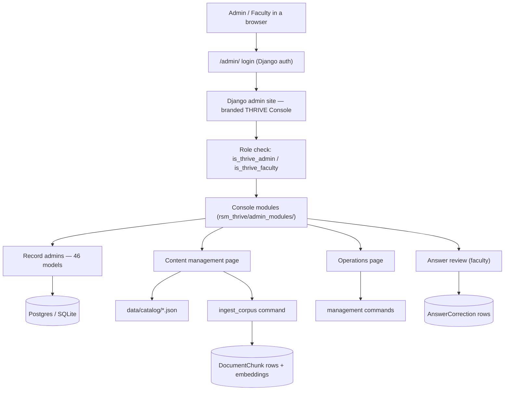
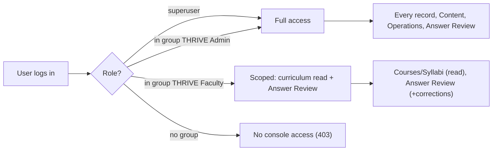
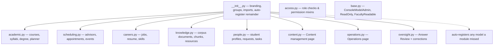
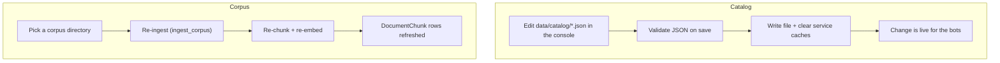

# THRIVE Console — Blueprint

A technical map of the admin/faculty backend UI: what it is, where each piece
lives, and how a request flows through it. Mermaid diagrams render on GitHub.

- **Where it runs:** the Django admin at `/admin/`, branded "THRIVE Console".
- **Who uses it:** THRIVE Admins (full) and THRIVE Faculty (scoped).
- **Branch:** `admin-console`. Not merged or deployed.

---

## 1. Architecture at a glance



The console is built **on** Django admin, not beside it: it reuses Django's
auth, permissions, CRUD, search, and change-history for free, and adds custom
pages only where content isn't ordinary model CRUD (catalog files, corpus
re-ingest, operations).

---

## 2. Access & roles

Two groups the console introduces, plus the maintainer superuser.



- Groups are created by migration `0028_console_groups`.
- Assign a user to a group in the console (Auth → Users) — a superuser does this
  today; an LDAP-to-group hook is a future addition.
- Gates live in `admin_modules/access.py` (`is_thrive_admin`,
  `is_thrive_faculty`, `AdminOnly`, `FacultyOrAdmin`).

---

## 3. Where everything is

All console code is under `backend/rsm_thrive/admin_modules/`, wired into Django
admin by one import at the end of `backend/rsm_thrive/admin.py`.



### File map

| Path | Responsibility |
|------|----------------|
| `admin_modules/__init__.py` | Branding ("THRIVE Console"), group names, imports every submodule, and auto-registers any remaining model so coverage is complete. |
| `admin_modules/access.py` | `is_thrive_admin`, `is_thrive_faculty`; `AdminOnly` and `FacultyOrAdmin` permission mixins. |
| `admin_modules/base.py` | `ConsoleModelAdmin` (admin-only), `ReadOnlyConsoleAdmin` (view-only), `FacultyReadableConsoleAdmin` (faculty read / admin write). |
| `admin_modules/academic.py` | Course, Syllabus (faculty-readable), Assignment, Enrollment, StudentAssignment, ProgramPhaseRow, DegreeRequirement, DegreeGap, CoursePlan, PlannerSession. |
| `admin_modules/scheduling.py` | Advisor, AppointmentSlot, Appointment, AppointmentNotification, Event. |
| `admin_modules/careers.py` | JobPosting, MatchReport, PostingInteraction, Skill, ResumeCourseHighlight, ResumeVersion. |
| `admin_modules/knowledge.py` | Document (editable), DocumentChunk (view-only), ResourceLink. |
| `admin_modules/people.py` | StudentProfile, CourseRequest, SharedTask, StudentTask, TaskOverride, TaskNote, QuickListItem, CustomCalendarEvent, CalendarPrefs. |
| `admin_modules/content.py` | Content management page: catalog JSON editor + corpus re-ingest. |
| `admin_modules/operations.py` | Operations page: run whitelisted management commands. |
| `admin_modules/oversight.py` | Answer Review (proxy of ChatTurnLog) + AnswerCorrection model/inline. |
| `admin.py` (outside the package) | Existing chat-trace admin (ChatTurnLog, TurnFeedback, Conversation); imports the package. |
| `templates/admin/content/*.html` | Content hub + catalog editor pages. |
| `templates/admin/operations/hub.html` | Operations page. |

---

## 4. Content management

The bots answer from two stores that aren't ordinary rows, so they have custom
pages instead of model CRUD.



- **Catalog:** `data/catalog/{courses,careers,bundles}.json`. Direct edits go
  live after cache clear. The durable path for course facts is: edit the
  syllabus markdown → run **Rebuild catalog** → re-ingest.
- **Corpus:** markdown under `data/corpus/{syllabi,program,crawled,canvas,thrive}/`.
  Re-ingest must run on the production embedding backend so vectors match.

---

## 5. Operations

Admin-only page to run whitelisted management commands (never arbitrary ones):

| Command | Does |
|---------|------|
| `build_catalog` | Rebuild `courses.json` from syllabi markdown. |
| `ingest_corpus` | Re-ingest a corpus directory (via Content management). |
| `ingest_jobs` | Fetch and upsert job postings. |
| `retry_notifications` | Re-send failed appointment notifications. |
| `refusal_report` | List questions the bots refused (content backlog). |
| `export_golden` | Turn thumbs-down feedback into eval cases. |
| `eval_bots` | Run golden cases through the bots. |
| `seed_demo` | Seed an idempotent demo world. |

---

## 6. Data model additions

Migrations added by the console (all additive):

| Migration | Adds |
|-----------|------|
| `0028_console_groups` | Creates the "THRIVE Admin" and "THRIVE Faculty" groups. |
| `0029_contenttool` | Unmanaged model hosting the Content management page (no table). |
| `0030_answerreview_answercorrection` | `AnswerReview` proxy + `AnswerCorrection` table. |
| `0031_operation` | Unmanaged model hosting the Operations page (no table). |

`AnswerCorrection` is the only new real table: `turn` (FK → ChatTurnLog),
`author` (FK → User), `note`, `created_at`.

---

## 7. Running & testing

```bash
cd backend
THRIVE_LLM=fake uv run python manage.py migrate
THRIVE_LLM=fake uv run python manage.py createsuperuser   # interactive
THRIVE_LLM=fake uv run python manage.py seed_demo          # demo data
THRIVE_LLM=fake uv run python manage.py runserver         # then open /admin/
```

Tests (all green — 30 console tests within a 2098-pass suite):

```bash
cd backend
THRIVE_LLM=fake uv run pytest rsm_thrive/tests/test_admin_console.py \
  rsm_thrive/tests/test_admin_content.py \
  rsm_thrive/tests/test_admin_oversight.py \
  rsm_thrive/tests/test_admin_operations.py -q
```

`test_admin_operations.py::test_every_app_model_is_registered` fails if any
model is left without a console admin — the completeness guarantee.

---

## 8. Not done yet (future)

- Scope faculty to their own courses (today: all courses read-only, all
  course-route turns).
- Feed AnswerCorrections back into retrieval/answers.
- Bulk import/export for catalog and roster.
- LDAP-to-group auto-assignment on login.
- Merge to `main` and deploy (gated, same on-server flow as the app).
